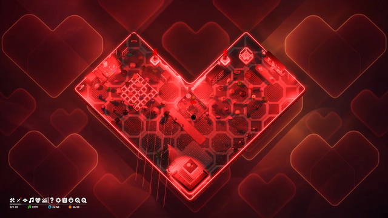
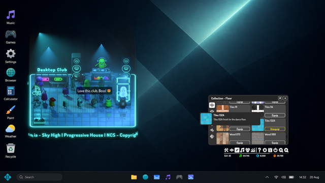
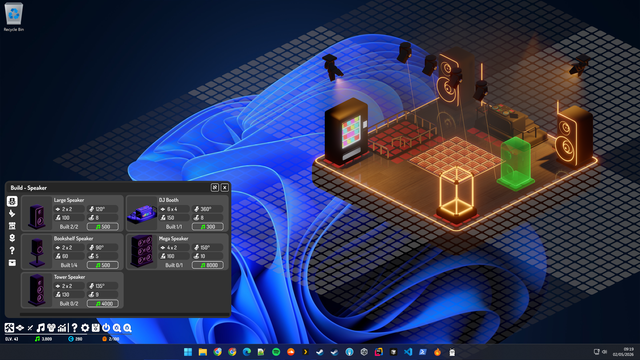
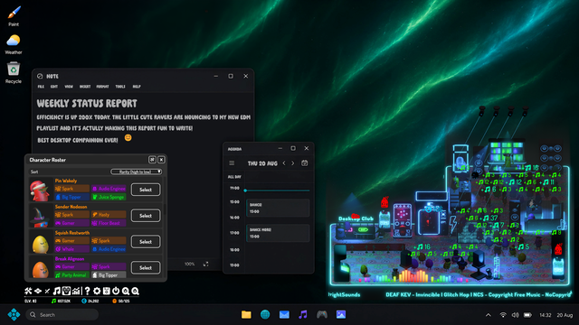
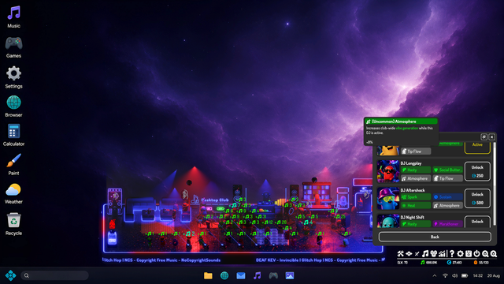
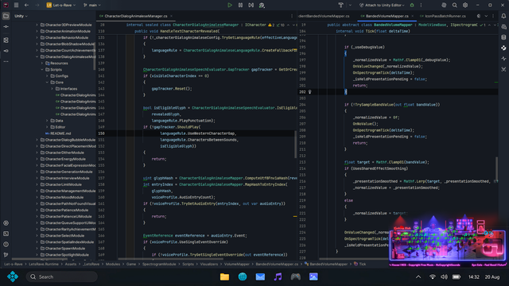
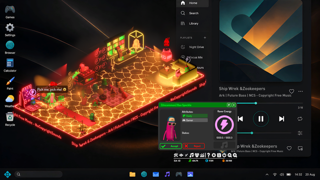
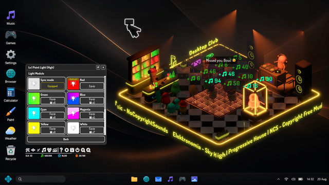
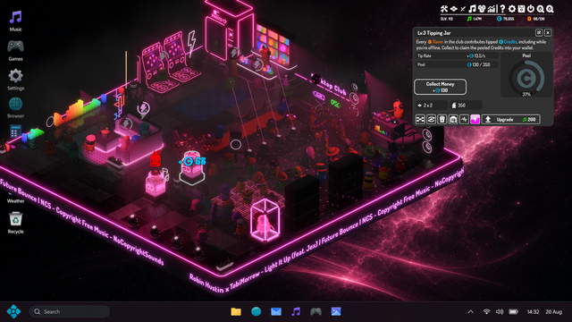
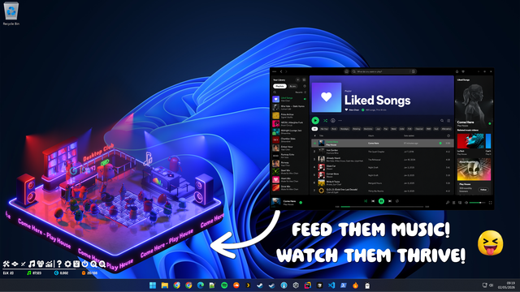

# Desktop Rave — screenshot gallery

[Press-kit home](../README.md) · [Essential ZIP](../Downloads/README.md) · [Logos and key art](../GraphicAssets/README.md)

Suggested credit: **Desktop Rave: Idle Audio Club / 28 Ducks**. Captions below may be copied or adapted under the [press-kit license](../LICENSE). Click an image for the original PNG.

**About these images:** these are supplied gameplay captures, with no recorded capture Build IDs. They illustrate the game; UI and content can differ from the current demo. The Level 11 showcase is identified below and is not in the essential demo pack. See the [demo FAQ](../Press%20Kit/Demo%20FAQ.md) for demo limits.

Previews are reduced in size only. Downloaded originals retain the supplied pixels. The essential ZIP uses the descriptive filenames shown below.

## Heart-shaped neon club

A heart-shaped club layout in Desktop Rave: Idle Audio Club, with red lighting and a crowd of Ravers.

**Gameplay screenshot** · 3840 × 2160 PNG · [Original PNG](https://github.com/victorcash/DesktopRavePressKit/raw/refs/heads/main/Screenshots/desktop-rave-heart-shaped-club.png) · **Included in essential pack**

Suggested filename: `desktop-rave-heart-shaped-club.png`

## Cyan club and Floor Skin collection

A cyan-lit desktop club beside the Floor Skin collection panel in Desktop Rave: Idle Audio Club.

**Gameplay screenshot** · 3840 × 2160 PNG · [Original PNG](https://github.com/victorcash/DesktopRavePressKit/raw/refs/heads/main/Screenshots/Screenshot2.png) · **Included in essential pack**

Suggested filename: `desktop-rave-cyan-club-floor-collection.png`

## Building a desktop club

The Build panel and a building placement preview in Desktop Rave: Idle Audio Club.

**Gameplay screenshot** · 3840 × 2160 PNG · [Original PNG](https://github.com/victorcash/DesktopRavePressKit/raw/refs/heads/main/Screenshots/Screenshot6.png) · **Included in essential pack**

Suggested filename: `desktop-rave-building-placement.png`

## A club alongside desktop notes

Desktop Rave: Idle Audio Club running beside a notes window, with the Ravers panel open.

**Gameplay screenshot with desktop context** · 3840 × 2160 PNG · [Original PNG](https://github.com/victorcash/DesktopRavePressKit/raw/refs/heads/main/Screenshots/Screenshot3.png) · **Included in essential pack**

Suggested filename: `desktop-rave-club-beside-notes.png`

## Wide club layout and progression panel

A wide neon club layout with its progression panel open in Desktop Rave: Idle Audio Club.

**Gameplay screenshot** · 3840 × 2160 PNG · [Original PNG](https://github.com/victorcash/DesktopRavePressKit/raw/refs/heads/main/Screenshots/Screenshot1.png)

Suggested filename: `desktop-rave-wide-club-progression.png`

## A club beside a code editor

A small Desktop Rave club sits in the corner of a desktop while a code editor occupies the main workspace.

**Gameplay screenshot with desktop context** · 3840 × 2160 PNG · [Original PNG](https://github.com/victorcash/DesktopRavePressKit/raw/refs/heads/main/Screenshots/Screenshot4.png)

Suggested filename: `desktop-rave-club-beside-code-editor.png`

## Orange-lit club beside a music player

An orange-lit club alongside an external music player in Desktop Rave: Idle Audio Club.

**Gameplay screenshot with desktop context** · 3840 × 2160 PNG · [Original PNG](https://github.com/victorcash/DesktopRavePressKit/raw/refs/heads/main/Screenshots/Screenshot5.png)

Suggested filename: `desktop-rave-orange-club-music-player.png`

## Choosing a Light Module

The Light Module selection panel beside a neon club in Desktop Rave: Idle Audio Club.

**Gameplay screenshot** · 3840 × 2160 PNG · [Original PNG](https://github.com/victorcash/DesktopRavePressKit/raw/refs/heads/main/Screenshots/Screenshot7.png)

Suggested filename: `desktop-rave-light-module-selection.png`

## Level 11 club and Tipping Jar showcase

A Level 11 gameplay showcase of Desktop Rave: Idle Audio Club with a Tipping Jar panel open. This image shows progression beyond the demo's Player Level 9 cap.

**Gameplay showcase beyond the demo level cap** · 3840 × 2160 PNG · [Original PNG](https://github.com/victorcash/DesktopRavePressKit/raw/refs/heads/main/Screenshots/Screenshot8.png)

Suggested filename: `desktop-rave-level-11-tipping-jar-showcase.png`

## Annotated music promotion image

A promotional desktop image of Desktop Rave: Idle Audio Club, with added text and an arrow highlighting the music connection.

**Annotated promotional image; not an unaltered gameplay screenshot** · 3840 × 2160 PNG · [Original PNG](https://github.com/victorcash/DesktopRavePressKit/raw/refs/heads/main/Screenshots/Screenshot0.png)

Suggested filename: `desktop-rave-music-promotion-annotated.png`
